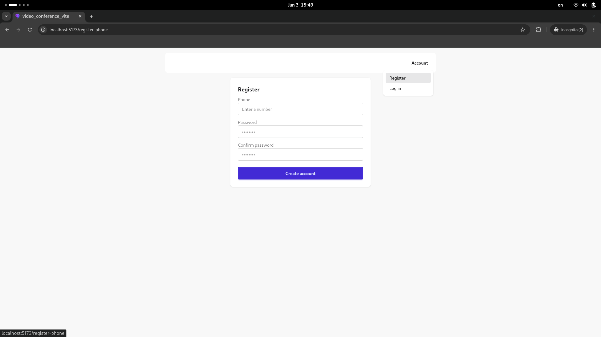
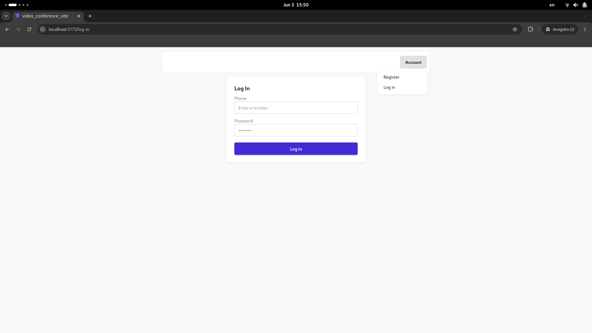
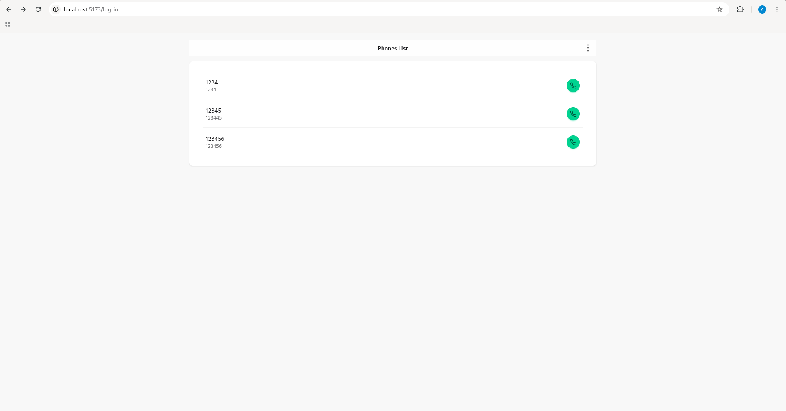
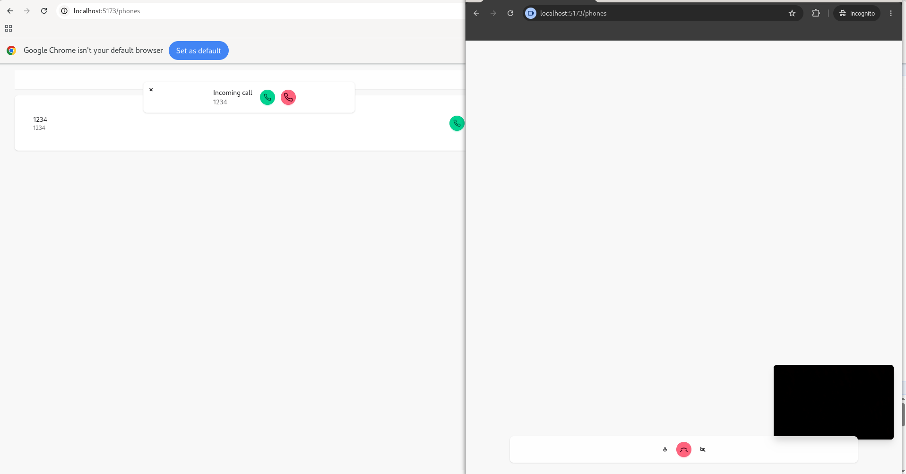
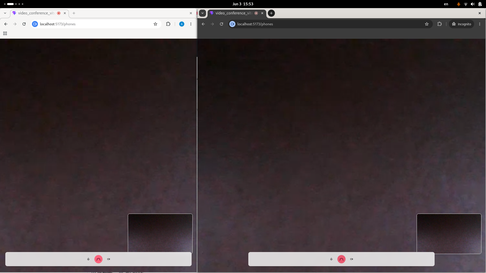

It is frontend part for [Video Conference app](https://github.com/AlexeyAlexey/video_conference) + [http3 server](https://github.com/AlexeyAlexey/http3_server)

It is a prototype. I use vite + js vanilla for fun

I want to have PWA at the end

https://v2.vitejs.dev/guide/#command-line-interface

npm install

npm run dev

npx vite dev

npx vite dev

npm install @capacitor/camera (I used capacitor to create Android package for shared link conference)

npm run build

npx cap copy android

add '?tpl' at the end of a file name when file is required to be imported as a template

TODO escape input template parameters [Cross-site scripting (XSS)](https://developer.mozilla.org/en-US/docs/Web/Security/Attacks/XSS)

./gen_release.sh "/absolute/path/to/local/folder"
./gen_release.sh "/home/alexey/Documents/elixir/videoconference_vite/video_conference_vite_rels"