# Video Conference (frontend)

A real-time **video & audio conferencing PWA** built with **Vite + vanilla JavaScript** (no framework). It streams media over **WebTransport (HTTP/3)** and uses the **WebCodecs API** to encode and decode video and audio in the browser.

This is the frontend for the [Video Conference app](https://github.com/AlexeyAlexey/video_conference) and pairs with the [http3_server](https://github.com/AlexeyAlexey/http3_server) media relay. It is a prototype — the goal is a fully installable PWA.

> Signalling (who is calling whom, shared-link management, auth) runs over **Phoenix Channels (WebSocket)**. The actual media (video/audio) runs over **WebTransport** so it is not blocked by the WebSocket channel.

---

## Features

- **One-to-one video calls** with live camera/mic, draggable self-view, and a call timer.
- **Shared conference links** — generate a link, optionally protect it with a password, rename it, copy it, or remove it (swipe-to-delete).
- **Phone book / contacts** with search and swipe-to-remove.
- **Incoming-call notifications** with answer/decline actions and a ringtone.
- **Responsive UI** (mobile + desktop) built with **Tailwind CSS + DaisyUI**.
- **PWA-ready** (web manifest, installable) and an **Android build via Capacitor**.

---

## Tech stack

| Concern            | Technology |
|--------------------|------------|
| Build tool         | Vite |
| Language           | Vanilla JavaScript (ES modules) |
| Styling            | Tailwind CSS + DaisyUI |
| Signalling         | Phoenix Channels (WebSocket) |
| Media transport    | WebTransport (HTTP/3) |
| Media codecs       | WebCodecs (`VideoEncoder`/`VideoDecoder`, `AudioEncoder`/`AudioDecoder`) |
| Audio playback     | Web Audio API + AudioWorklet |
| Mobile             | Capacitor (Android) |

---

## Screenshots

**Register**
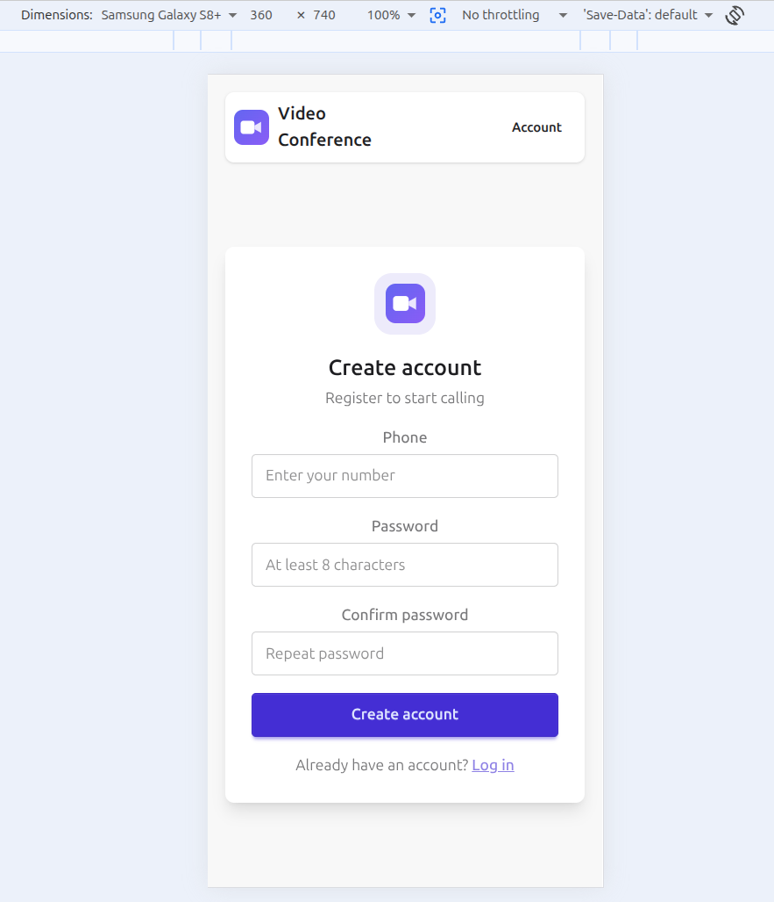

**Log In**
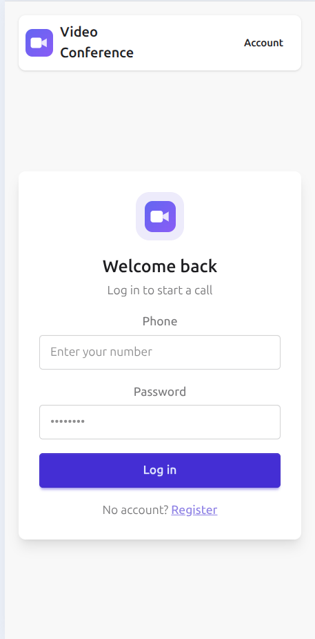

**Phones List**
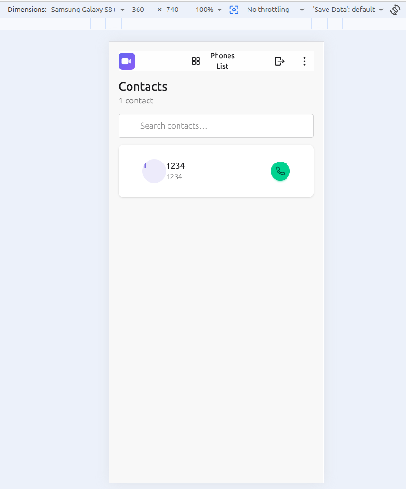

**Call Notification**
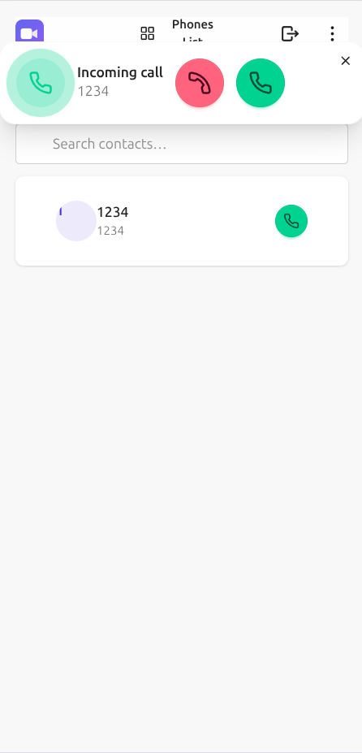

**One-to-One Call**
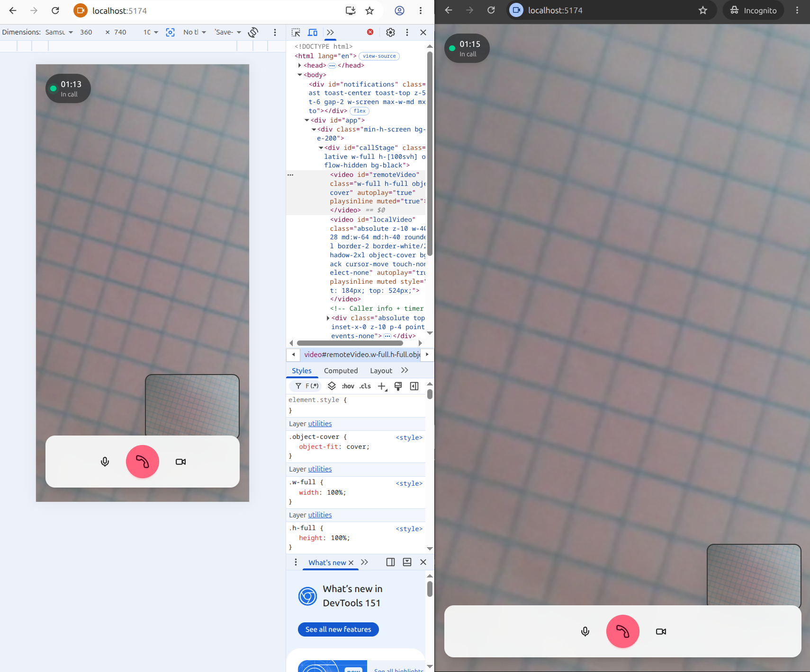

**Page Menu**
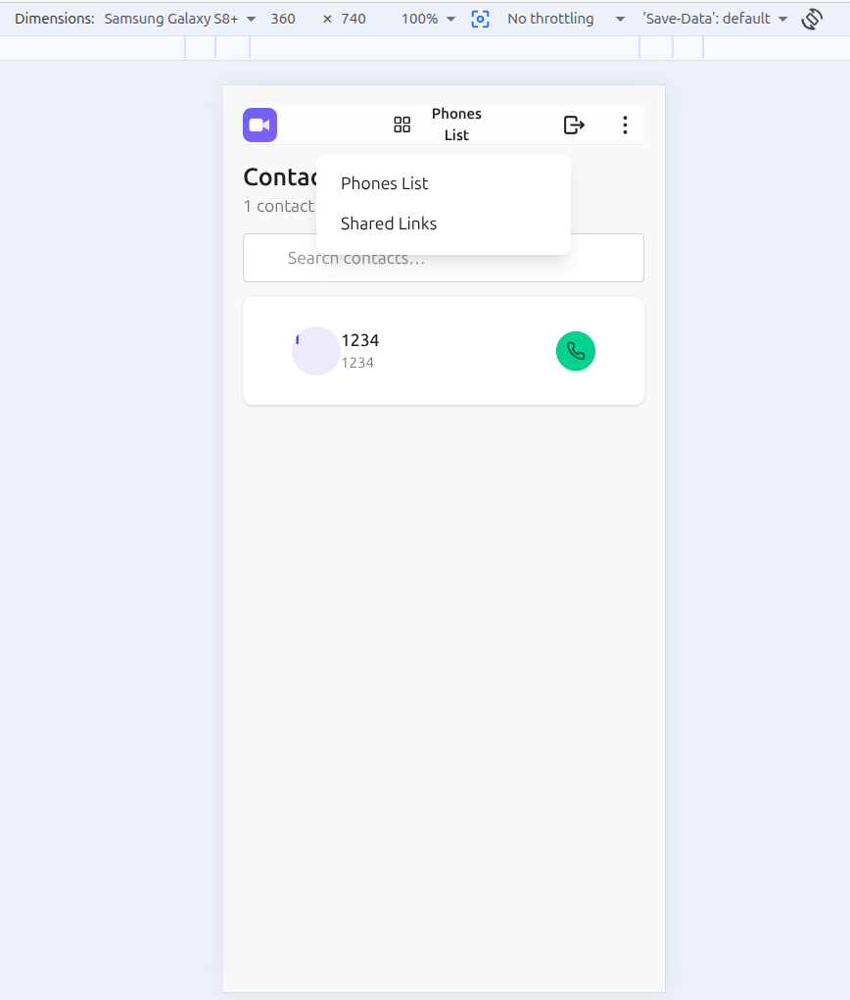

**Action Menu**
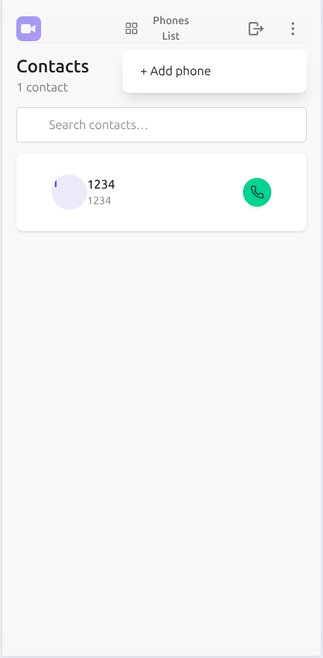

### Shared Links

**Click on a field to edit**
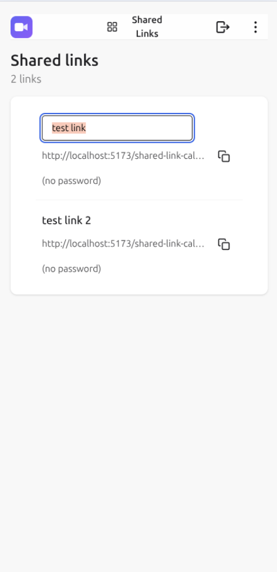

**Swipe left to remove**
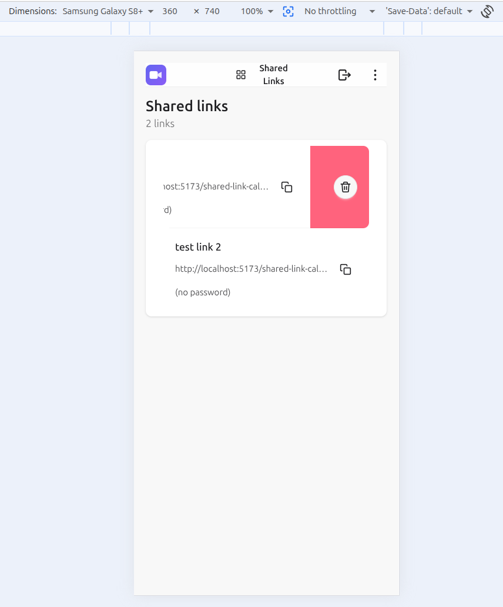

**Shared Links action menu**
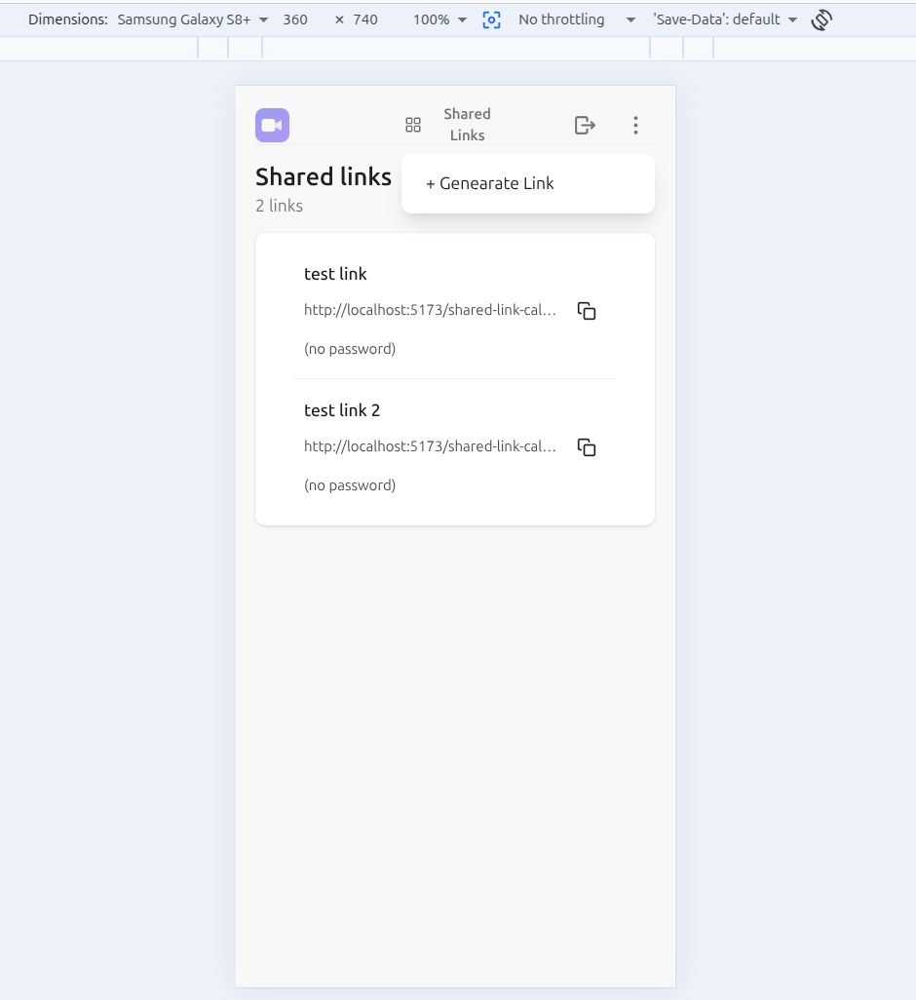

**Generate link modal form**
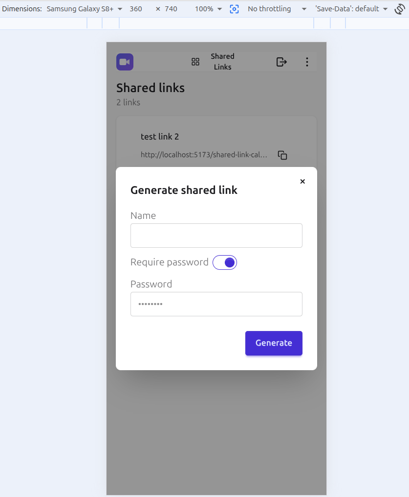

**Shared conference link — password to join**
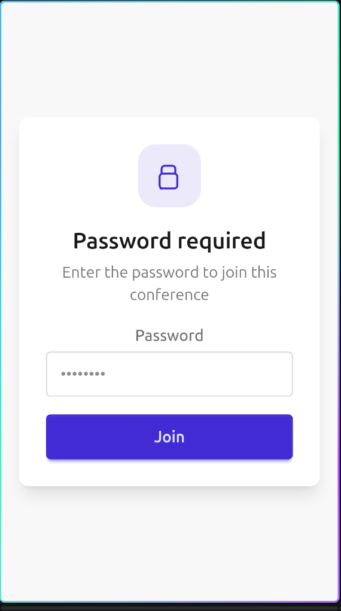

---

## How the app encodes & decodes media

The browser captures the camera/mic, encodes the frames with **WebCodecs**, wraps each encoded chunk in a small **binary protocol**, and ships it over a **WebTransport** stream. The remote side does the reverse: it parses the binary stream, reconstructs `EncodedVideoChunk` / `EncodedAudioChunk` objects, decodes them, and renders the result.

The encode/decode helpers live in [`src/utils/`](src/utils/).

### 1. Capture → encode (sender)

`src/userStreamCamera.js` owns the sender pipeline.

**Video**
1. `getUserMedia()` provides a `MediaStream`.
2. A `MediaStreamTrackProcessor` turns the video track into a stream of `VideoFrame`s.
3. A `VideoEncoder` (WebCodecs) is configured for **VP8** at the track's resolution/framerate in `realtime` latency mode.
4. A loop reads each `VideoFrame`, calls `encoder.encode(frame, { keyFrame })` (a key frame is forced every `keyInterval` frames), then `frame.close()`.
5. The encoder's `output(chunk, metadata)` callback fires for every `EncodedVideoChunk`.

**Audio**
1. A `MediaStreamTrackProcessor` turns the audio track into a stream of `AudioData`.
2. An `AudioEncoder` (WebCodecs) is configured for **Opus** at the track's sample rate/channels.
3. Each `AudioData` is fed to `encoder.encode(...)`.
4. The encoder's `output(chunk)` callback fires for every `EncodedAudioChunk`.

In both cases the encoded bytes are copied out with `chunk.copyTo(u8)` and handed to the protocol packer.

### 2. The binary wire protocol

Each packet is framed as:

```
+--------+----------------------+----------------------+
|  "MS"  |   packageLength      |        payload        |
| 2 byte |   4 byte (big-end)   |   packageLength bytes |
+--------+----------------------+----------------------+
```

- **`MS`** (`0x4D 0x53`) is a magic marker so the receiver can re-synchronise the byte stream.
- **`packageLength`** is the length of the payload that follows.
- All multi-byte integers are **big-endian**.

`StreamMessageParser` (`src/streamMessageParser.js`) reassembles the raw WebTransport byte stream into these packets and hands the **payload** (everything after the 6-byte framing) to the decoder.

The **first byte of the payload** is the chunk type:

| Type | Meaning |
|------|---------|
| `0` | Audio chunk |
| `1` | Video chunk |
| `2` | Ringtone (binary audio) |
| `3` | Close-call message (text) |
| `4` | Event (JSON) |

After the type byte, a media payload carries a small fixed header followed by the encoded body:

| Field | Size | Notes |
|-------|------|-------|
| `seq` | 4 | sequence number |
| `type` | 4 | `0` = delta, `1` = key frame |
| `key` | 4 | video only — `0` = delta, `1` = key |
| `ts` | 8 | 64-bit timestamp |
| `byteLength` | 4 | length of the body |
| `body` | N | the encoded bytes (VP8 / Opus) |

The encoders build the header with a `DataView` (`setUint32`, `setBigUint64`, …) and concatenate it with the body into a single `Uint8Array`. The decoders read the same fields back and return a plain object:

```js
{ dataType: 'video'|'audio'|'event'|'ringtone'|'close',
  seq, type, ts, byteLength, body /* Uint8Array */ }
```

- **Video** — `src/utils/encodeVideoChunk.js` / `decodeVideoChunk.js`
- **Audio** — `src/utils/encodeAudioChunk.js` / `decodeAudioChunk.js`
- **Event** — `src/utils/encodeEvent.js` / `decodeEvent.js` (body is JSON, e.g. participant join/leave/rename)

`src/utils/decodeChunk.js` is the dispatcher: it inspects the type byte and routes to the right decoder.

### 3. Transport

`src/streamServer.js` opens a **WebTransport** connection to the media relay and creates a **bidirectional stream**. The writer side sends the packed `Uint8Array`s from step 2. The reader side pipes incoming bytes through `StreamMessageParser` (`src/streamMessageParser.js`), which reassembles the byte stream into discrete packets (using the `packageLength` field) and emits one packet at a time. Reconnection uses exponential backoff with jitter.

### 4. Decode → render (receiver)

`src/remoteUserPlayer.js` owns the receiver pipeline.

**Video** — `src/videoDecoder.js`
1. Each decoded packet is enqueued into a bounded queue (drops delta frames under back-pressure to stay realtime).
2. A `VideoDecoder` (WebCodecs) is configured for VP8.
3. Each queued chunk is wrapped in `new EncodedVideoChunk({ type, timestamp, data })` and passed to `decoder.decode(...)`.
4. Decoded `VideoFrame`s are written to a `MediaStreamTrackGenerator`, whose `MediaStream` is attached to a `<video>` element.

**Audio** — `src/audioDecoder.js`
1. Each decoded packet is wrapped in `new EncodedAudioChunk({ type: 'key', timestamp, data })` and passed to an `AudioDecoder` (WebCodecs) configured for Opus.
2. Decoded `AudioData` is copied into `Float32Array` planes and posted to an **AudioWorklet** (`src/pcm-player-processor.js`), which schedules the PCM samples onto the `AudioContext` output for low-latency playback.

### 5. Conferences

For multi-participant calls the same media payloads are used, but the framing and the payload are extended so the receiver can route each chunk to the correct participant tile. The parser is `src/conferenceCall/conferenceStreamParser.js` and the decoder is `src/utils/conference/decodeConferenceChunk.js`.

Each packet is framed as:

```
+--------+----------------------+----------------------+
|  "MSE" |   packageLength      |        payload        |
| 3 byte |   4 byte (big-end)   |   packageLength bytes |
+--------+----------------------+----------------------+
```

- **`MSE`** (`0x4D 0x53 0x45`) is the magic marker — one byte longer than the one-to-one `MS` marker.
- **`packageLength`** is the length of the payload that follows (read at offset 3).
- All multi-byte integers are **big-endian**.

`ConferenceStreamParser` reassembles the raw WebTransport byte stream into these packets and hands the **payload** (everything after the 7-byte framing) to the decoder.

The payload is the one-to-one media payload **prefixed with a 4-byte participant id**:

```
offset  size  field
0       4     participantId (which tile this media belongs to)
4       1     chunkType (0 = audio, 1 = video, 2 = ringtone, 3 = close, 4 = event)
5       …     media header + body (same layout as the one-to-one payload)
```

| Field | Size | Notes |
|-------|------|-------|
| `participantId` | 4 | routes the chunk to a participant tile |
| `chunkType` | 1 | `0` = audio, `1` = video, `2` = ringtone, `3` = close, `4` = event |
| `…` | N | the standard media header (`seq`, `type`, `key`, `ts`, `byteLength`) + encoded body |

`decodeConferenceChunk` reads the `participantId` and `chunkType`, then delegates the rest to the same `decodeAudioChunk` / `decodeVideoChunk` / `decodeEvent` helpers used for one-to-one calls, and attaches `participantId` to the result.

---

## Project structure

```
src/
  main.js                 # entry point, event wiring
  router.js               # client-side routing (path → controller)
  controller.js           # base Controller (call / destroy lifecycle)
  managerWS.js            # Phoenix Socket wrapper (signalling)
  streamServer.js         # WebTransport connection manager (media)
  streamMessageParser.js  # reassembles the binary byte stream into packets
  userStreamCamera.js     # capture + WebCodecs encode (sender)
  remoteUserPlayer.js     # WebCodecs decode + render (receiver)
  videoDecoder.js         # VideoDecoder wrapper (queue + track generator)
  audioDecoder.js         # AudioDecoder wrapper (AudioWorklet playback)
  phoneCall.js            # one-to-one call orchestration
  conferenceCall/         # multi-participant call orchestration
  channels/               # Phoenix channels (phone, …)
  api/                    # REST API clients (auth, phone book, shared links)
  notifications/          # incoming-call toast
  pages/                  # one folder per route (controller + template)
  utils/                  # binary protocol encode/decode helpers
    encodeVideoChunk.js / decodeVideoChunk.js
    encodeAudioChunk.js / decodeAudioChunk.js
    encodeEvent.js / decodeEvent.js
    decodeChunk.js        # dispatcher
    conference/           # conference variant (participant id prefix)
```

**Templates** are plain HTML files imported with a `?tpl` suffix (see `plugins/template-plugin.js`), which turns them into a `template(props)` function.

---

## Getting started

```bash
npm install
npm run dev        # start the Vite dev server (http://localhost:5173)
npm run build      # production build
npm run preview    # preview the production build
```

### Environment variables

The backend is configured via Vite env vars (see `src/api/baseApi.js`):

- `VITE_MANAGER_HTTP_SERVER_PROTOCOL` — `http` / `https`
- `VITE_MANAGER_SERVER_HOST` — API host
- `VITE_MANAGER_HTTP_SERVER_PORT` — API port
- `VITE_MANAGER_WEBSOCKET_SERVER_PROTOCOL` — `ws` / `wss`
- `VITE_SCHEMA`, `VITE_HOST`, `VITE_PORT` — used to build shared-link URLs

### Android (Capacitor)

```bash
npm install @capacitor/camera
npm run build
npx cap copy android
```

### Release

```bash
./gen_release.sh "/absolute/path/to/local/folder"
```

### Notes

- Append `?tpl` when importing a file as a template.
- Register with an invitation token: `http://localhost:5173/register-phone?invitation_token=1234321`

### TODO

- Escape template parameters to prevent [XSS](https://developer.mozilla.org/en-US/docs/Web/Security/Attacks/XSS).